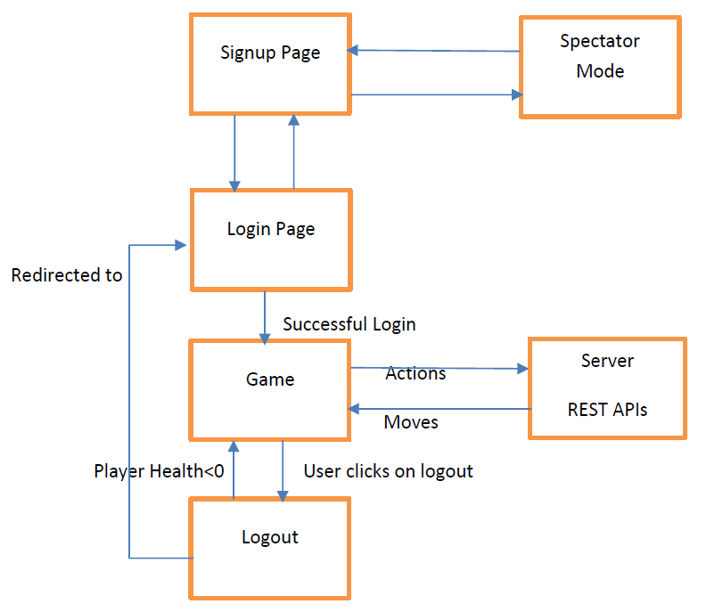

# Module 2 group project #

Submitted by: 
 

Team members:

- shukl031@umn.edu 
- naras036@umn.edu
- mulka002@umn.edu
- khand052@umn.edu

Heroku URL: [tank5117.herokuapp.com](tank5117.herokuapp.com)

**GameName:Tank Shootout**

 

GameDescription:

1.	We have developed a multiplayer Tank shootout game, where multiple users can join either ‘Terrorist’ or ‘Counterterrorist’ team to play against each other.
2.	User has to sign up for the first time to play the game. After successful signup, user will be redirected to login page, where he has to login with valid credentials to join and play the game.All the user information is stored on the MongoDB.We are using Express sessions to maintain the client's session on the browser.
3.	There are two modes in the game. Game mode and Spectator mode.In game mode user can play the game and in spectator mode, user can watch the current state of the game.
4.	User has to login with valid credentials to play the game. Login task is not required to view the game.
5.	To move left and right User has to use arrow keys to perform the action.
6.	Space button is used to shoot bullets.
7.	The game is fun to play and there are multiple elements added, to make it enjoyable. User will be able to play with 2d tanks and 2d bullets. We have also added a sound to indicate the bullet sound.
8.	In both the modes, we have a scoreboard available, which will give the details of top players with the highest scores in the history of the game. For this, we are using REST api from the mongoDB.
9.	We are also tracking user score, User name, User’s health status and number of remaining bullets on the User’s game page. This will give the current statistics of the game which will be refreshed periodically. 
10.  After a user exhauts his bullets, user has to wait for 10 seconds to relaod the game. This is wonderful feature and mimics the real world experience.
11.	User can logout from the game whenever he wants to opt out from the game. We clear the user session and remove all the states related to player.
12.	Once the user has lost all his health, he will be logged out of the game.

Ambitious:

1. Complete project is built from scratch which took a lot of effort.
2. We have developed a wonderful UI for login, signup and gameplay.
3. We have put a lot of effort to design the logic and satisfy multiple user scenarios.
4. The game is developed in such a way to keep in alignment with the project guidelines. We have used Express, node js and Mongo DB in a very effective way. 
5. User gets the actual feel of the game play. We have put in lot of effort to make sure the game developed is not just technically strong but also user friendly and enjoyable.

Very well Executed:

1. We worked as a team and executed the project with a very good plan. Team work helped us a lot to achieve the project goals.
2. The code developed is highly modular. This helped in code debugging and bug fixing.
3. We have developed efficient data structures to reduce the complexity of the algorithm used to develop the game.

## Description ##

 
For this module you will be making a multi-user, online game using Express,
WebSockets, and MongoDB. Your final product will need to have these components:

- An API that can be used to get information about the current state of the
  the game and post moves to the game. This will be how the game can be played.
- A view to watch the game in real time.
- A statistics page for the game.

### What constitutes a game? ###
Google says that the definition of "game" is "a form of play or sport" and who
are we to argue with Google. You could do something relatively simple like
[Twitch Plays Tic-tac-toe](https://en.wikipedia.org/wiki/Twitch_Plays_Pok%C3%A9mon)
to something as complicated as your own
[MUD](https://en.wikipedia.org/wiki/MUD). It doesn't need to be elaborate or
highly visual.

### API: Playing the game ###
You need to write an web API that will let people easily write clients to play your
game. Suppose our game is [tug-of-war](https://en.wikipedia.org/wiki/Tug_of_war).
Then I would want to be able to get `/rope-position` for information about the
current position of the rope in
[JSON format](https://en.wikipedia.org/wiki/JSON) and post to `/pull-on-left`
or `/pull-on-right` to affect the state of the game.

You will need to develop a set of tools, scripts, or code that will test and
demonstrate the capabilities of your API. You can use whatever languages you
want to accomplish this. Both
[node.js](http://stackoverflow.com/questions/5643321/how-to-make-remote-rest-call-inside-node-js-any-curl/5643366#5643366)
and
[python](http://stackoverflow.com/questions/4476373/simple-url-get-post-function-in-python)
are capable of this. There is a good chance your favorite language can do it
also.

If you just want to poke at your API a little bit you can use tools like
[Postman](https://www.getpostman.com/) and
[Advanced REST client](https://chrome.google.com/webstore/detail/advanced-rest-client/hgmloofddffdnphfgcellkdfbfbjeloo?hl=en-US)
as in browser options or
[curl](https://curl.haxx.se/docs/manpage.html) on the command line.
Curl has the benefit that it is available on almost all systems.

### Watching the game ###
Create a view for spectators. Your players will be interacting via your API,
but you should also have a way for spectators to watch via a webpage. This
should update in real time, so you will need to use WebSockets to push
events out to the UI.

What you display here is up to your own judgment, just make sure it is
something worth watching. If you were doing tic-tac-toe, I would want to watch
as the board fills up. If you were doing hangman, I would want to see the
gallows being built. You don't need fancy graphics, just provide some way of
conveying action.

Other potential options:

- twitter-like stream of events
- scoreboard
- live-updating charts

### Stats overview ###
The final requirement is some statistics web page for the game. This can be
displaying the number of times a person took a specific action, the amount of
time that it took a game to finish, et cetera. Show any statistics that you
think would be interesting for your specific game. You can make this static or
use web sockets to update content live here.

## Setting up your database ##
Someone from each group should create an account with [mLab](https://mlab.com/)
and setup a free sandbox database. This will be the database you should use for
your project. __If you want to connect from inside the UMN you should send us
the URI they gave you.__ We will then send you back a URI you can use to
connect.

### The reasoning (in case you want to know) ###
The reason you need to do this is that the UMN network blocks certain outgoing
ports. These are also the ports that mLab uses to let you connect. We have a
server outside of UMN that listens on ports that are not blocked and will
forward your traffic on to mLab.

## Submission ##
- Your code should be pushed up to your repo on github
- Fill this `README.md` out with your team name, team members' emails, and
  Heroku url for your demo. Additionally, complete the argument sections at the
  top of the file.
- Create a file called `API.md` that documents your api endpoints and how to
  use them. These should include a valid `curl` command and a description of its
  expected output.

## Grading ##
You will be graded on the __ambition__ and __execution__ of the project. At
the top of this `README.md` you have the opportunity to argue why your
submission was ambitious and well executed. In order for us to grade it, you
must have it hosted on Heroku. To earn an "A" grade, a project must be
technically ambitious, well-executed, and polished. To earn a passing grade, a
project must minimally fulfill the three requirements listed in the description.

Sources:
www.w3schools.org
stackoverflow.com 
https://www.tutorialspoint.com

